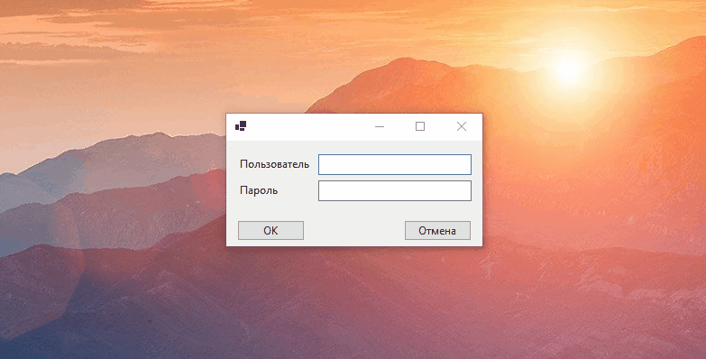

# dela

Приложение может иметь частичную реализацию, при это в каждом классе должны быть описаны:

- поля (с комментарием к каждому полю);
- конструкторы;
- методы (можно без реализации, но с подробным комментарием, что данный метод делает).

Каждое дело задается:
текстовой описание, дата, исполнитель, статус (сделать, в процессе, готово).

После запуска приложения на форме отображаются три списка:
сделать,
в процессе,
готово.
(данные хранятся в файле)

Пользователь может:
добавить новое дело в список "сделать";
перемещать дело между списками (при этом меняется статус);
удалить дело из списка "готово".

Приложение могут использовать несколько пользователей. Для работы с приложением необходимо зарегистрироваться. После авторизации пользователю отображается его список дел.
